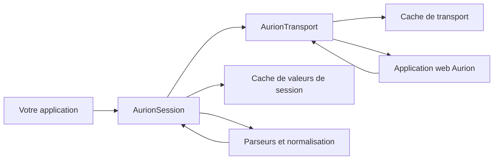
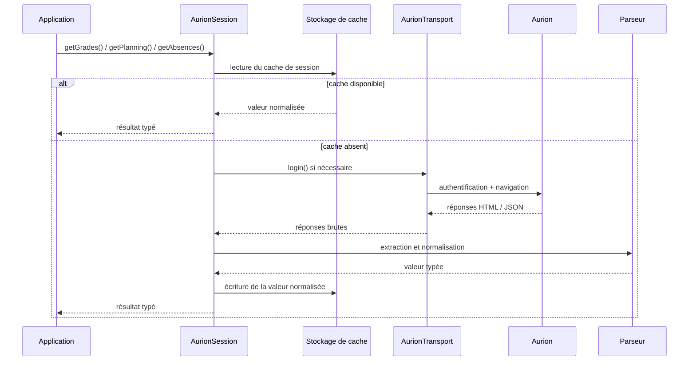

# aurion-sdk

SDK TypeScript pour s’authentifier auprès d’Aurion et extraire les notes, événements de planning et absences via une API typée.

## Explication

`aurion-sdk` encapsule l’interface web Aurion derrière un client orienté session. Vous créez une instance de `AurionSession`, le SDK s’authentifie de manière paresseuse lors du premier accès réel aux données, navigue dans les pages JSF nécessaires à Aurion, analyse les charges utiles retournées, puis renvoie des objets JavaScript normalisés.

Le SDK est structuré en trois couches principales :



- `AurionSession` est le point d’entrée public principal.
- `AurionTransport` gère l’authentification, les cookies, les redirections et les requêtes HTTP.
- Les modules de `parsers/*` convertissent les charges utiles HTML et JSON d’Aurion en valeurs SDK typées.
- La couche de cache peut réutiliser à la fois les réponses de transport et les valeurs métier déjà normalisées.

### Flux de requête



## Guides pratiques

### Comment installer le SDK

```bash
npm install aurion-sdk
```

Le SDK utilise l’API Fetch. Si votre runtime n’expose pas de `fetch` global, fournissez-en une via `fetchFn` lors de la création de la session.

### Comment récupérer les notes

```ts
import { AurionSession } from "aurion-sdk";

const session = new AurionSession({
	username: process.env.AURION_USERNAME!,
	password: process.env.AURION_PASSWORD!,
});

const grades = await session.getGrades();

for (const grade of grades) {
	console.log({
		date: grade.date,
		code: grade.code,
		name: grade.name,
		grade: grade.grade,
		average: grade.average,
	});
}
```

### Comment récupérer les événements du planning

`getPlanning()` accepte une fenêtre temporelle optionnelle. Si vous l’omettez, le SDK utilise une fenêtre par défaut qui commence 7 jours avant l’appel et se termine 60 jours après ce point de départ.

```ts
import { AurionSession } from "aurion-sdk";

const session = new AurionSession({
	username: process.env.AURION_USERNAME!,
	password: process.env.AURION_PASSWORD!,
});

const planning = await session.getPlanning({
	start: new Date("2026-04-01T00:00:00.000Z"),
	end: new Date("2026-04-30T23:59:59.999Z"),
});

for (const event of planning) {
	console.log(event.title, event.start, event.end, event.type);
}
```

### Comment récupérer les absences

```ts
import { AurionSession } from "aurion-sdk";

const session = new AurionSession({
	username: process.env.AURION_USERNAME!,
	password: process.env.AURION_PASSWORD!,
});

const absences = await session.getAbsences();

for (const absence of absences) {
	console.log(absence.date, absence.type, absence.duration);
}
```

### Comment activer le cache intégré

Définissez `cache: true` pour utiliser le cache en mémoire fourni par le SDK.

```ts
import { AurionSession } from "aurion-sdk";

const session = new AurionSession({
	username: process.env.AURION_USERNAME!,
	password: process.env.AURION_PASSWORD!,
	cache: true,
});
```

### Comment utiliser un stockage de cache personnalisé et des TTL

```ts
import { AurionSession, InMemoryAurionCache } from "aurion-sdk";

const cacheStore = new InMemoryAurionCache();

const session = new AurionSession({
	username: process.env.AURION_USERNAME!,
	password: process.env.AURION_PASSWORD!,
	cache: {
		store: cacheStore,
		maxAgeMs: 5 * 60 * 1000,
		sessionMaxAgeMs: 60 * 1000,
		transportMaxAgeMs: 5 * 60 * 1000,
	},
});
```

Les clés de cache incluent à la fois `baseUrl` et `username`, ce qui évite les collisions entre plusieurs instances Aurion ou plusieurs comptes partageant le même stockage.

### Comment gérer les erreurs du SDK

```ts
import { AurionSession, isAurionError } from "aurion-sdk";

const session = new AurionSession({
	username: process.env.AURION_USERNAME!,
	password: process.env.AURION_PASSWORD!,
});

try {
	const grades = await session.getGrades();
	console.log(grades.length);
} catch (error: unknown) {
	if (isAurionError(error)) {
		console.error(error.code, error.message, error.details);
	} else {
		console.error("Erreur inattendue", error);
	}
}
```

## Référence

### Exports principaux

| Export | Type | Rôle |
|---|---|---|
| `AurionSession` | classe | Client SDK de haut niveau pour les notes, le planning et les absences |
| `isAurionError` | fonction | Garde de type pour les erreurs structurées du SDK |
| `InMemoryAurionCache` | classe | Stockage de cache mémoire intégré |
| `resolveAurionCacheConfig` | fonction | Normalise la configuration publique du cache |
| `resolveAurionCacheStore` | fonction | Résout un stockage de cache concret à partir des options publiques |
| `createAurionCacheKey` | fonction | Construit les clés de cache du transport |
| `createAurionValueCacheKey` | fonction | Construit les clés de cache des valeurs de session |
| `isAurionCacheEntryExpired` | fonction | Vérifie l’expiration TTL des entrées de cache |
| `parseGrades`, `parsePlanningEvents`, `parseAbsences` | fonctions | Parseurs bas niveau pour les charges utiles Aurion brutes |
| `toAurionGrade`, `toAurionAbsence` | fonctions | Convertissent des lignes brutes parsées en objets SDK normalisés |
| `parseAurionPlanningTitle`, `parseLocationToAddress`, `parseGradeToDetails` | fonctions | Utilitaires de plus haut niveau pour le post-traitement côté consommateur |

### `AurionSession`

```ts
new AurionSession(options: AurionSessionOptions)
```

Champs de `AurionSessionOptions` :

| Champ | Type | Description |
|---|---|---|
| `username` | `string` | Identifiant de connexion Aurion |
| `password` | `string` | Mot de passe Aurion |
| `fetchFn` | `typeof fetch` | Implémentation personnalisée optionnelle de `fetch` |
| `cache` | `boolean \| AurionCacheStore \| AurionCacheOptions` | Configuration du cache |
| `baseUrl` | `string` | URL optionnelle de l’instance Aurion, par défaut `https://aurion.junia.com` |

Méthodes principales :

| Méthode | Retour | Notes |
|---|---|---|
| `getGrades()` | `Promise<AurionGrade[]>` | Authentifie à la demande, navigue vers les notes et parse le tableau HTML |
| `getPlanning(options?)` | `Promise<AurionPlanningEvent[]>` | Charge les événements de planning sur une fenêtre fournie ou par défaut |
| `getAbsences()` | `Promise<AurionAbsence[]>` | Navigue vers les absences et renvoie des enregistrements normalisés |

### Formes de données

#### `AurionGrade`

```ts
interface AurionGrade {
	date: Date;
	code: string;
	name: string;
	grade: number | null;
	coefficient: number | null;
	average: number | null;
	min: number | null;
	max: number | null;
	median: number | null;
	standardDeviation: number | null;
	comment: string | null;
}
```

#### `AurionPlanningEvent`

```ts
interface AurionPlanningEvent {
	id: string;
	title: string;
	start: Date;
	end: Date;
	allDay: boolean;
	editable: boolean;
	type: string;
}
```

#### `AurionAbsence`

```ts
interface AurionAbsence {
	date: Date;
	type: string;
	duration: string;
	time: Date;
	class: string;
	teacher: string;
}
```

### Codes d’erreur

Le SDK expose des erreurs structurées avec les codes normalisés suivants :

- `AURION_AUTHENTICATION_ERROR`
- `AURION_NAVIGATION_ERROR`
- `AURION_PARSING_ERROR`
- `AURION_TRANSPORT_ERROR`
- `AURION_UNKNOWN_ERROR`
- `AURION_NOT_IMPLEMENTED`

## Notes

- Le point d’entrée publié du package est `src/index.ts`, compilé dans `dist/`.
- `dist/` est une sortie générée et ne doit pas être modifié manuellement.
